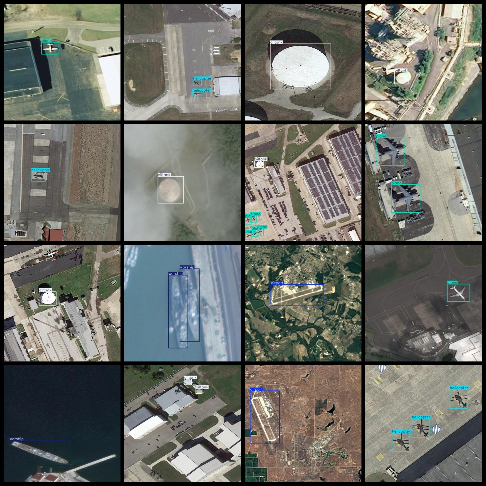
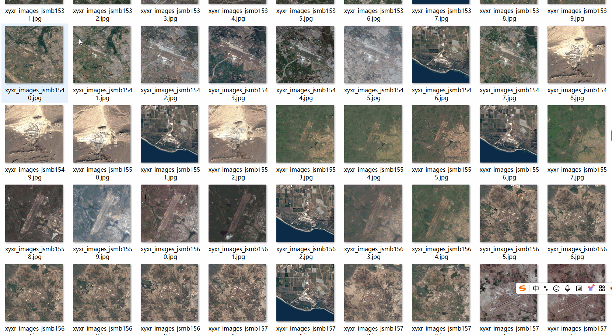

# UAV Aerial Military Target Detection Dataset 8781 imagesVOC+YOLO format

This dataset contains 8781 images of military targets, in the format of VOC+YOLO.

Dataset Format: VOC format + YOLO format

The compressed file contains: three folders, each storing images, xml files, and text files.

Total jpg images in JPEGImages folder: 8781

The total number of XML files in the Annotations folder is 8781.

The total number of txt files in the labels folder is 8781.

Number of tag types: 5

Tag names: ["airport","helicopter","oiltank","plane","warship"]

Tags: "Airport", "Helicopter", "Oil Tank", "Plane", "Navy Ship"

The number of boxes for each label (Note that the order of labels in the Yolo format does not correspond to this, but is based on the classes.txt file in the labels folder):

airport frame count = 1593

helicopter frame count = 3093

oiltank frame count = 5052

plane frame count = 6670

warship frame count = 3351

Total boxes: 19759

Picture clarity (Resolution: Pixels): Clear

Image Enhancement: Yes

Shape of the label: Rectangular box, used for object detection and recognition.

Important Note: None

Special Notice: This dataset does not guarantee the accuracy or precision of the trained models or weight files. The dataset only provides accurate and reasonable annotations.

Annotation and image details are as follows:

## Images

---

Here is a pay link on Stripe (https://buy.stripe.com/3cs8yP7sY87d0vu9AB). Please contact me lonlonago@foxmail.com after funding $89, and I will send you a complete data files, thank you!

